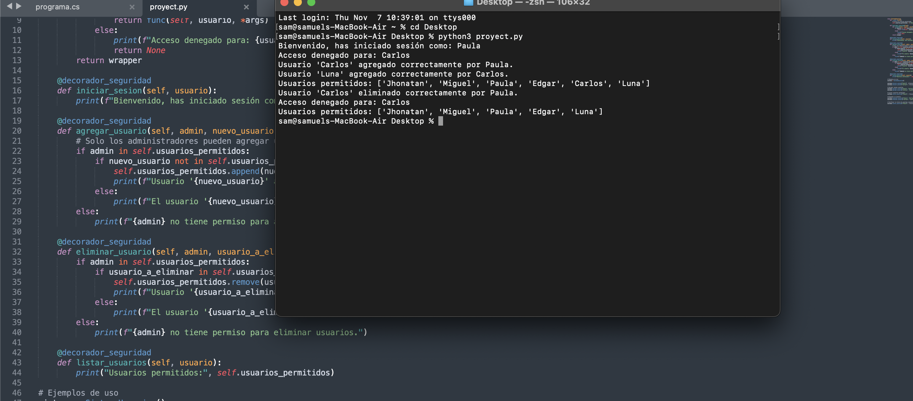

# Taller Aspectos 

## Samuel Leyton Muñoz - Taller Paradigma Aspectos


### 1. En pocas palabras, el objetivo principal de la POA es:

 Opcion :
 
 c.	Separar conceptos y minimizar las dependencias entre ellos
 
 Justificacion : 

 Esta centrado en separar los conceptos que significan lo mismo que los aspectos , esto mejora la modularidad y de esta manera lo que se trata es de evitar las dependencias las cuales pueden o ser muy extensas o ademas de eso evitar que los programas tengan errores que pueden ser causados por la sobrecarga . Con la POA generamos moludaridad y recorta el uso de dependencias lo cual nos da como resultado una mejor seguridad , no tocar el codigo principal y que de esta manera no sea afectado .
 

### 2. ¿Cuál es el inconveniente que se presenta al usar las metodologías iterativas y POO?

   Opcion : 
   
   b.	No se considera el tratamiento de aspectos como seguridad y gestión de
memoria

   Justificacion : 
   
Los problemas de la rprogrmacion orientada a objetos y iterativa es que son debiles en la utilizacion de memoria y en la seguridad que pueden tener sus sistemas en cuestion de carga de datos .

Para poder gestionar esos aspectos en la programacion orientada a eventos es necesario el agregar mas clases y objetos los cuales implican mas gestion y modificacion para mantener la aplicacion .
   
   

### 3. ¿Cuál de las siguientes opciones no es uno de los inconvenientes que se presentan al implementar la POA?

  Opcion : 
  
  d.	Posibles choques entre los aspectos

  Justificacion : 

  La programacion orientada a aspectos se tiende a estructurar de una manera modular entre los difernetes aspectos lo cual evita los choques entre aspectos .

### 4. ¿En qué consiste el código mezclado (Code Tangling)?

   Opcion : 
   
   a.	Varios requerimientos pueden estar dentro de un mismo módulo.

   Justificacion : 

   El codigo mezclado es aquel modulo que tiene diferentes requerimientos y funciones . El problema de este codigo es que no es tan sencillo hacer la separacion de los aspectos y sus propias debilidades o problemas . Este tipo de problemas siempre tratan de estar lejos de la programacion orientada a eventos ya que el principal objetivo de la programaicon orientada a eventos es que sea mas sencilla y sus funcionalidades se puedan dividir . En estos programas tan complejos es mejor tratar otros metodos .
   


### 5. ¿Cuáles de los siguientes elementos son propios de la POA?

   Opcion : 
   
   b.	Puntos de corte, tejedores, puntos de enlace.

   Justificacion :

   Los puntos de corte son aquellos en los cuales se aplica principalmente los aspectos como por ejemplo : 
   
   - Creacion de objetos
   - Llamada a un metodo
   - Cuando se esta ejecutando un metodo 
    
   Los tejedores son aquellas conexiones entre los aspectos y el lugar donde se apliquen junto con el codigo fuente .

   
   Los puntos de enlace es el momento en el que se integran los aspectos dentro del propio flujo de el codigo .


### 6. Una incumbencia transversal o ‘crosscutting concern’ es:

   Opcion : 
   
   c.	La conceptualización de responsabilidades de uso común en un sistema

   Justificacion : 

   Esto es cuandoi se encuentran aspectos los cuales pueden afectar de alguna manera en una faceta del sistema . Por ejemplo puede ser algun aspecto el cual solucione diferentes vulnerabilidades de seguridad .Se implementa en modulos de un solo aspecto o diferentes modulos para una misma faceta .
   

### 7. En un banco se desea aplicar el concepto de la programación orientada a aspectos, un aspecto que se podría abstraer sería:
 
   Opcion : 
   
   b.	La validación de una transacción de un cliente o empleado del banco.

   Justificacion : 

   No esta limitada a una clase o metodo . No mezcla el codigo fuente con los puntos de flujo .

### 8. ¿Qué se define en un consejo?

   Opcion : 
   
   b.	El código que debe ser ejecutado en los puntos de unión

   Justificacion : 

   Los consejos se aplican en los puntos de union , las uniones son : 

   - Cuando se llama un metodo
   - Momento de ejecucion de algun metodo
   - El momento de crear objetos

   Se aplican en estos puntos ya que estos arreglos o consejos se deben ejecutar en un momento preciso . Funcional principalmente para generar funciones transversales (que no son dependientes en la mayoria de casos , de las funciones ).
   Como ejemplo de esto les puedo dar : 
   - La gestion de transacciones
   - cuestiones de creacion de usuarios y contraseñas

 Esto se hace para que estas creaciones o modificaciones dentro del sistema no afecten directamente a el codigo fuente o base . Evitan vulnerabilidades comunes o sencillas  .

   

### 9. La Programación Orientada a Aspectos (POA) es un paradigma cuya intención es permitir una adecuada _____________ de las aplicaciones, posibilitando mejor separación de incumbencias.

   Opcion : 
   
   b.	Modularización

   Justificacion : 

   La programacion orientada a aspectos esta especificamente diseñada para desarrollarse de manera modular o una manera en la cual los diferentes problemas que afectan al sistema .

   Como ejemplo de esto podria ser : 
   
   - En sistemas de seguridad principalmente basados en usuarios individuales que confian su seguridad en el prestador de servicio el cual le confian su informacion , lo que las empresas hacen es fraccionar el problema y las diferentes gestiones en el Logging de manera no centrica.
   - La programacion orientada a aspectos lo que busca es dividir los problemas de seguridad para que el manejo de errores sea mayor y sencillo .
   - La programacion orientada a aspectos es sencilla en cuestion visual y algo compleja en cuestion de conexion con los diferentes aspectos en que se puede basar un programa o sistema . Aunque al ser modular su mantenimiento y resolucion de bugs o errores se soluciona de manera mas directa y los errores son faciles de encontrar.

### 10.De los siguientes términos, ¿cuál está relacionado con la POA?

   Opcion : 
   
   d.	Tejedor

   Justificacion : 

   - El tejedor se basa de manera concisa en el procedimiento que se utiliza el codigo fuente o codigo base del programa con los diferentes aspectos que se creen . Crea puntos de interes o tambien llamadas preocupaciones en problemas transversales los cuales buscan otra solucion .

   

### Ejercicio de implementación 


```python 
class SistemaUsuarios:
    def __init__(self):
        
        self.usuarios_permitidos = ["Jhonatan", "Miguel", "Paula", "Edgar"]

    def decorador_seguridad(func):
        def wrapper(self, usuario, *args):
            if usuario in self.usuarios_permitidos:
                return func(self, usuario, *args)
            else:
                print(f"Acceso denegado para: {usuario}")
                return None
        return wrapper

    @decorador_seguridad
    def iniciar_sesion(self, usuario):
        print(f"Bienvenido, has iniciado sesión como: {usuario}")

    @decorador_seguridad
    def agregar_usuario(self, admin, nuevo_usuario):
        # Se estipula que los usuarios determinados como "admin " o administradores son aquellos que pueden agregar a alguien mas o pueden dejarlos acceder en la consola 
        if admin in self.usuarios_permitidos:
            if nuevo_usuario not in self.usuarios_permitidos:
                self.usuarios_permitidos.append(nuevo_usuario)
                print(f"Usuario '{nuevo_usuario}' agregado correctamente por {admin}.")
            else:
                print(f"El usuario '{nuevo_usuario}' ya existe.")
        else:
            print(f"{admin} no tiene permiso para agregar usuarios.")

    @decorador_seguridad
    def eliminar_usuario(self, admin, usuario_a_eliminar):
        if admin in self.usuarios_permitidos:
            if usuario_a_eliminar in self.usuarios_permitidos:
                self.usuarios_permitidos.remove(usuario_a_eliminar)
                print(f"Usuario '{usuario_a_eliminar}' eliminado correctamente por {admin}.")
            else:
                print(f"El usuario '{usuario_a_eliminar}' no existe.")
        else:
            print(f"{admin} no tiene permiso para eliminar usuarios.")

    @decorador_seguridad
    def listar_usuarios(self, usuario):
        print("Usuarios permitidos:", self.usuarios_permitidos)


sistema = SistemaUsuarios()

sistema.iniciar_sesion("Paula")  
sistema.iniciar_sesion("Carlos")  


sistema.agregar_usuario("Paula", "Carlos") 
sistema.agregar_usuario("Carlos", "Luna")   


sistema.listar_usuarios("Paula")  


sistema.eliminar_usuario("Paula", "Carlos")  
sistema.eliminar_usuario("Carlos", "Luna")   


sistema.listar_usuarios("Paula")  
```
## Análisis codigo

El codigo es algo distinto a lo pedido pero llega a ser mas enfocado a un sistema de vida real ya que lo que hago es crear usuarios con diferentes tipos de cargos dentro del entorno . 

Tengo tanto a un usuario comun el cual no cuenta con acciones dentro del sistema mas que existir y tengo al usuario admin el cual tiene las capacidades de agregar a un usurio o de eliminarlo del sistema .

### codigo 




### Conclusión

Secuencial: Suficiente para listas pequeñas. <br>
Corrutinas: Adecuado para tamaños de listas medianas o en sistemas con pocos núcleos. <br>
ForkJoinPool: Recomendado para listas grandes y sistemas multicore. <br>
